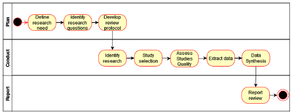
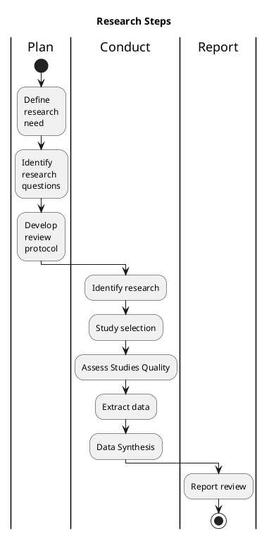

# Laboratório de Investigação

Investigar consiste em identificar problemas, colocar questões, refletir, admitir erros, aprender novas coisas e tentar encontrar soluções utilizando um método científico, o que pode ser recompensador:


Documentação e recursos para a disciplina de Laboratório de Investigação. Como é que podemos abordar o problema, onde se procura responder a questões como:
* Como é que podemos fazer uma revisão de literatura? 
* Como é que podemos fazer uma pesquisa bibliográfica? 
* Quais são as ferramentas que podemos utilizar?
* Como é que podemos utilizar ASReview para a seleção de artigos? 
* Como é que podemos utilizar o Zotero para a gestão de referências bibliográficas?
* Como é que podemos utilizar a inteligência artificial para apoiar a investigação?

# Workflow para a elaboração de um plano de investigação
* Qual é o problema subjacente à investigação do estudo ou projeto? 
  * Formular uma questão de investigação
  * Depois de formular a questão de investigação, podemos definir sub-questões, e.g. Questão qual é o impacto da pandemia COVID-19 no ensino à distância? Sub-questões: Quais são as vantagens e desvantagens do ensino à distância? Quais são as ferramentas tecnológicas mais utilizadas no ensino à distância? Quais são as competências necessárias para o ensino à distância?
  * Explicar sucintamente cada uma das sub-questões, frase curtas, 1 ou 2 linhas
* Utilizar o PICOC (Population, Intervention, Comparison, Outcome, Context) como base para a criar a 'string' de pesquisa:
* Exemplificar uma questão de investigação e sub-questões a partir de um problema dos alunos
* Ferramentas que podemos utilizar para fazer uma revisão de literatura:
  * Exemplificar com um problema dos alunos como se faz uma revisão de literatura
  * Utilização do [Parsifal](https://parsif.al/about/) para ajudar nos objectivos, PICOC, questões de pesquisa, search string, keywords e sinónimos, seleção das fontes, critérios de inclusão e exclusão, bem como os mecanimos necessários para construir uma checklist para uma checklist para uma avaliação qualitativa e formulários extração de dados.
  * Um ficheiro Excel para a avaliação qualitativa das questões de investigação
  * Como importar os artigos selecionados para o zotero.... TODO...
  * Utilização do Zotero para a gestão de referências bibliográficas
* Pesquisar em bases de dados científicas
  * Scopus (Bom mas é pago e não é acessível a todos)
  * IEEE Digital Library (Conseguimos pesquisar)
  * SpringerLink (Conseguimos pesquisar)
  * Science@Direct (Conseguimos pesquisar)
* Exemplificar com um problema dos alunos como se faz uma pesquisa bibliográfica
* Utilização do ASReview para a seleção de artigos
  * Instalação	e exemplo de utilização do [ASReview](https://asreview.readthedocs.io/en/latest/index.html) 
    * Com conda: `conda install -c conda-forge asreview`
    * Com pip: `pip install asreview`
    * Com docker: `docker run -it asreview/asreview:latest`
  * Importação das referências selecionadas do ASReview para o Zotero
* Utilização do Zotero para a gestão de referências bibliográficas

# Bases de dados

* [ACM Digital Library](http://portal.acm.org)
* [IEEE Digital Library](http://ieeexplore.ieee.org)
* [ISI Web of Science](http://www.isiknowledge.com)
* [PubMed](https://www.ncbi.nlm.nih.gov/pubmed/)
* [Science@Direct](http://www.sciencedirect.comg
g [Scopus](http://www.scopus.com)
* [Springer Link](http://link.springer.com)

# Ferramentas apoio

* [ResearchKit](https://www.researchkick.com/start)
* [Scribbr](https://www.scribbr.com/plagiarism-checker/)
* [Bibliometrix](https://www.bibliometrix.org/home/)
* AI powered literature review and tools for researchers:
  * Revisão de literatura:
    * [Perplexity](https://perplexity.ai/):  Answering questions in a comprehensive and informative way, similar to a search engine but with more conversational abilities
    * [Elicit](https://elicit.com/): Research assistant that uses language models to automate research tasks, such as finding relevant papers, summarizing papers, and answering questions
    * [Sematicscholar](https://www.semanticscholar.org/)
    * [Anysummary](https://www.anysummary.app/)
    * [ChatPDF](https://chatpdf.com/)
  * Definição de hipóteses:
    * Utilização da inteligência artificial generativa para GPT3/4 a partir de uma prompt 

## Bibliometrix

```
install.packages("bibliometrix")
```

file <- "./exemplos/caso1/ScienceDirect_citations_1731876458350.bib"

M <- convert2df(file = file, dbsource = "isi", format = "bibtex")

## Pesquisa com AI
A Prompt mágica

```
You are an expert computer science. Your research interests are in Predictive Analytics, 
Machine Learning, and Data Mining. You are interested in generating hypotheses in the field of 
Computer Science and Artificial Intelligence.
Your task is to generate counterintuitive yet plausible hypotheses. They should
combine different sub fields of Computer Science and advance theoretical knowledge.
They should not be incremental.
Make sure that your hypotheses are precisely stated and incorporate a comparison
group. Begin each hypothesis with "Hypothesize that" and generate 100 hypotheses.
```


# Documentos de apoio

* Etapas gerais para revisão de literatura [aqui](./docs/01.revisao_literatura.pdf)
* Utilização do [Zotero](./docs/02.zotero_Ferramentas.pdf)
* Instalação [Docker](./docs/03.instalacao_docker.pdf), mais simples é mesmo com Anaconda para ASReview


# Exemplo 

To development of the systematic literature review, the methodology applied by Kitchenham & Charters [3] was adopted and developed in three stages, namely, planning, conducting and reporting.



Também podemos gerar o diagrama com [plantuml](https://plantuml.com/).



Enquadrar o exemplo com


## Caso 1

Problema de estudo: Utilização de drones para prever a evolução de um incêndio através da inteligência Artificial

Baseado neste problema de investigação foram formuladas as seguintes questões: 

* RQ1: Qual é o estado da arte da investigação que está a ser desenvolvida?
* RQ2: Quais são os algoritmos que são utilizados para prever a evolução do incêndio?
* RQ3: Quais são as variáveis utilizadas para prever a evolução dos incêndios?
* RQ4: Quais são os equipamentos que estão ser utilizados para recolher os dados?

The authors used the Petticrew and Roberts (CITACAO) Population, Intervention, Comparison, Outcome and Context (PICOC).

* Population: Estudos que abordem utilização de drones para prever incêndios
* Intervention: Algoritmos de Machine Learning para prever evolução dos incêndios
* Comparison: Diferentes tipos de algoritmos para prever os incêndios
* Outcome: Resumo das questões de pesquisa, algoritmos utilizados e lacunas existentes na investigação
* Context: Academia e indústria

Baseado no PICOC seguindo a abordagem recomendada por Kitchmen e Charters (REF) o critério de pesquisa foi, por 
exemplo:

`(wildfire) AND (drones) AND ("machine Learning" OR prediction OR "Deep Learning" OR "Predictive Analytics")`

A partir da keywords de pesquisa, vamos procurar nas base de dados: SpringerLink, Science@Direct, 
IEEE Digital Library, and ACM Digital Library.
Os artigos identificados podem ser colocados num quadro resumo com o número de artigos identificados nas diferentes bases de dados.

A pesquisa é feita no title, abstract, and keywords, definindo um intervalo de pesquisa, por exemplo January 2010 and 
2024 (Outubro), definindo os critérios de exclusão (Livros, patentes, teses de mestrado e artigos que não estão em inglês).
Para realizar o screening dos artigos podem utilizar o ASReview para ajudar no processo de seleção e organizar os artigos
selecionados. Também devem colocar os critérios de inclusão (artigos com revisão por pares).

Critérios de exclusão: Review articles (110); Encyclopedia (11); Book chapters (81); Conference abstracts (2); Book reviews (1); Correspondence (1); Data articles (1); Discussion (3); Editorials (6); Mini reviews (8); Short communications (3); Other (17)

### Pesquisa nas bases de dados bibliográficas

Vamos colocar um exemplo com as pesquisas nas bases de dados:
* [Science@Direct](https://www.sciencedirect.com/search?qs=%28wildfire%29%20AND%20%28drones%29%20AND%20%28%22machine%20Learning%22%20OR%20prediction%20OR%20%22Deep%20Learning%22%20OR%20%22Predictive%20Analytics%22%29)
* [SpringerLink](https://link.springer.com/search?new-search=true&query=%28wildfire%29+AND+%28drones%29+AND+%28%22machine+Learning%22+OR+prediction+OR+%22Deep+Learning%22+OR+%22Predictive+Analytics%22%29)
* IEEE Digital Library
* ACM Digital Library

Na springerlink exportar os ficheiros um por cada página ([ver ficheiros](./exemplos/caso1/)) depois processamos em R, ver [exemplo](./exemplos/caso1/1.slr_bibtexCleaning.Rmd).

### Seleção de artigos com asreview

Ver apresentação como é que se podem utilizar o ASReview para selecionar os artigos [aqui](./docs/01.revisao_literatura.pdf).
Em alternativa também podem importar os artigos exportados da pesquisa para bibtex e importar para o Zotero. A vantagem é que o zotero faz a gestão dos artigos
e podem inclusive remover os duplicados. Esta lista de artigos depois pode ser exportada para csv para tratarem no asreview. 

###  Importar as referências selecionadas para o Zotero

```R
install.packages("bibtex")       # Para exportar BibTeX
# Carregar bibliotecas
library(bibliometrix)
library(bibtex)

# Exemplo: Exportar o dataframe `merged_data` para BibTeX
write.bib(as.BibEntry(merged_data), file = "exported_data.bib")
```

Depois importar no zotero através do menu `File -> Import...` e selecionar o ficheiro `exported_data.bib`.

Um exemplo de uma SLR [aqui](https://ieeexplore.ieee.org/document/9693903) e [aqui](https://aisel.aisnet.org/capsi2021/18)(mais simples).

Neste caso podem utilizar os ficheiros selecionados
e realizarem a análise exportando a lista final dos artigos selecionados para bibtex e importar para o Zotero.

### Processar os artigos analisados

Ver exemplo de bibliometrix para processar os artigos analisados [aqui](./exemplos/caso1/bibliometrix.Rmd) e realizarem uma análise quantitativa dos artigos selecionados. 
Depois podem complementar esta análise com a analise qualitativa dos artigos selecionados processando os artigos selecionados no asreview.
Um exemplo como podem fazer a análise qualitativa dos artigos selecionados [aqui](./docs/quality_assessment_research_questions.xlsx).
Cada questão de pesquisa é processada e analisada de forma qualitativa, por exemplo, para a questão de pesquisa 1. 
É possivel estruturar as colunas também para identificar por exemplo os algoritmos utilizados, as variáveis utilizadas, os equipamentos utilizados, etc.

#


Convém fazer uma contextualização em relação a problema, nomeadamente para perceber como é que se está a investigar, tipo
de terminologia utilizada, por exemplo para perceber que estudos estão a ser feitos para "afinar" as questões de pesquisa e 
termos/sinónimos a utilizar na string de pesquisa para fazer a introdução à revisão de literatura.
Ver exemplo [aqui](https://elicit.com/notebook/6b00c2c5-a34a-4df3-94ee-3db1663e53a5). Depois podem interagir com os PDFs dos artigos e pedirem para resumir as ideias principais, utilizando por exemplo ChatPDF ou analisando com mais detalhe, lendo com 
algum cuidado os artigos.
Outro aspeto importante é perceber se existem revisões de literatura similares ao que estão a fazer e não fazer o mesmo. Caso
existam, tentar alterar o âmbito ou o problema de estudo para diferenciar.


# Datasets 

```
datasets
    https://ieee-dataport.org/datasets
    https://www.kaggle.com/
    https://fivethirtyeight.com/
    https://www.data.gov/
    https://www.quandl.com/
    https://www.reddit.com/r/datasets/
    https://archive.ics.uci.edu/ml/index.php
        university of california
    Exploratory data catalog
        https://exploratory.io/note/kanaugust/Online-Seminar-23-Exploratory-Data-Catalog-Democratize-Data-within-Organization-rvM6bOq3XV
    https://data.world/
    https://datasetsearch.research.google.com/
    https://opendata.stackexchange.com/
    Government
        http://data.un.org
            United Nations
        http://www.data.gov
            US
        http://data.gov.uk
            United Kingdom
        http://www.data.gouv.fr
            France
        http://data.gov.gh
            Ghana
        http://data.gov.au
            Australia
        https://www.govdata.de
            Germany
        http://www.gov.hk/en/them/psi/datasets
            Hong Kong
        http://www.data.go.jp
            Japan
        http://www.data.gov/opendatasites
    https://www.europeandataportal.eu/en
    https://basedosdados.org/
    sport
        https://footystats.org/predictions/
        https://sports-statistics.com/soccer/fifa-2022-dataset-csvs/
    https://data.oecd.org/
    https://rapidapi.com/hub
        APIs
        Acesso a dados
        algumas free
```


# Bibliografia

[1]: Biggam, J. (2021). Succeeding with Your Master’s Dissertation: A Step-by-Step Handbook. McGraw-Hill Education.

[2]: Dawson, C. (2019). Introduction to Research Methods 5th Edition: A Practical Guide for Anyone Undertaking a Research Project. Robinson
Press.

[3]: Kitchenham, B., & Charters, S. (2007). Guidelines for performing Systematic Literature Reviews in Software Engineering. Keele University

[4]: Aria, M., & Cuccurullo, C. (2017). bibliometrix: An R-tool for comprehensive science mapping analysis. Journal of Informetrics, 11(4), 959–975.